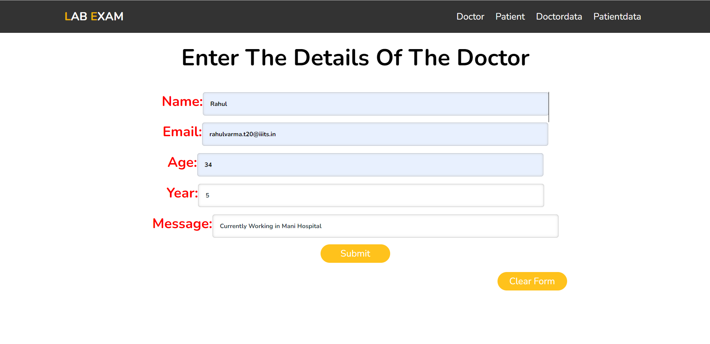
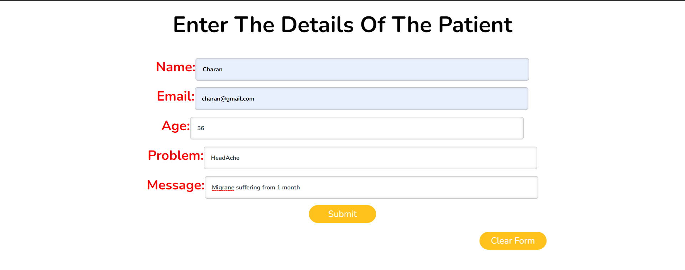
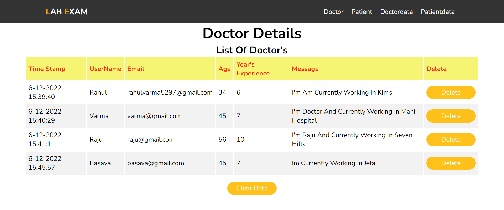
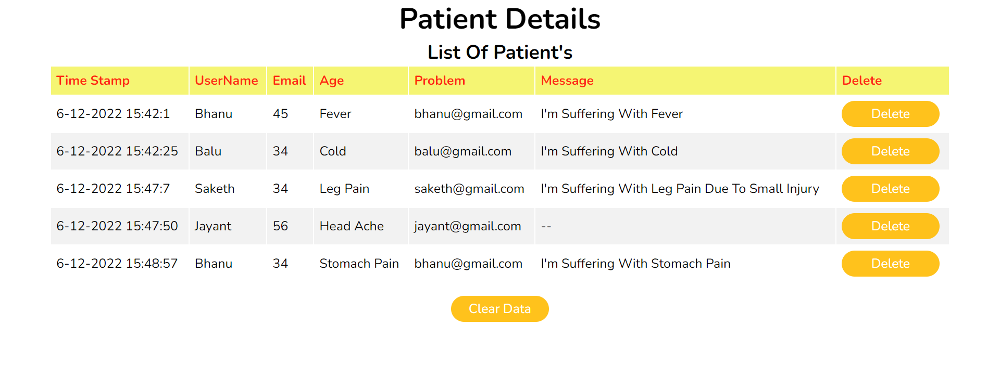

# SEM 5 LAB EXAM 
##### - COMPONENTS ARE AS FOLLOWED:

### 1. Navbar

### 2. Doctor Form

### 3. Patient Form

### 4. Doctor Data

### 5. Patient Data

Process to run:

Change terminal to Client:
and run npm i
for installing modules
and run using npm start

and 

go to server
and run npm start.

Run both client and server.